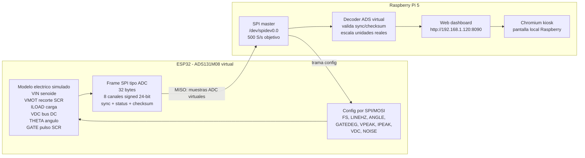
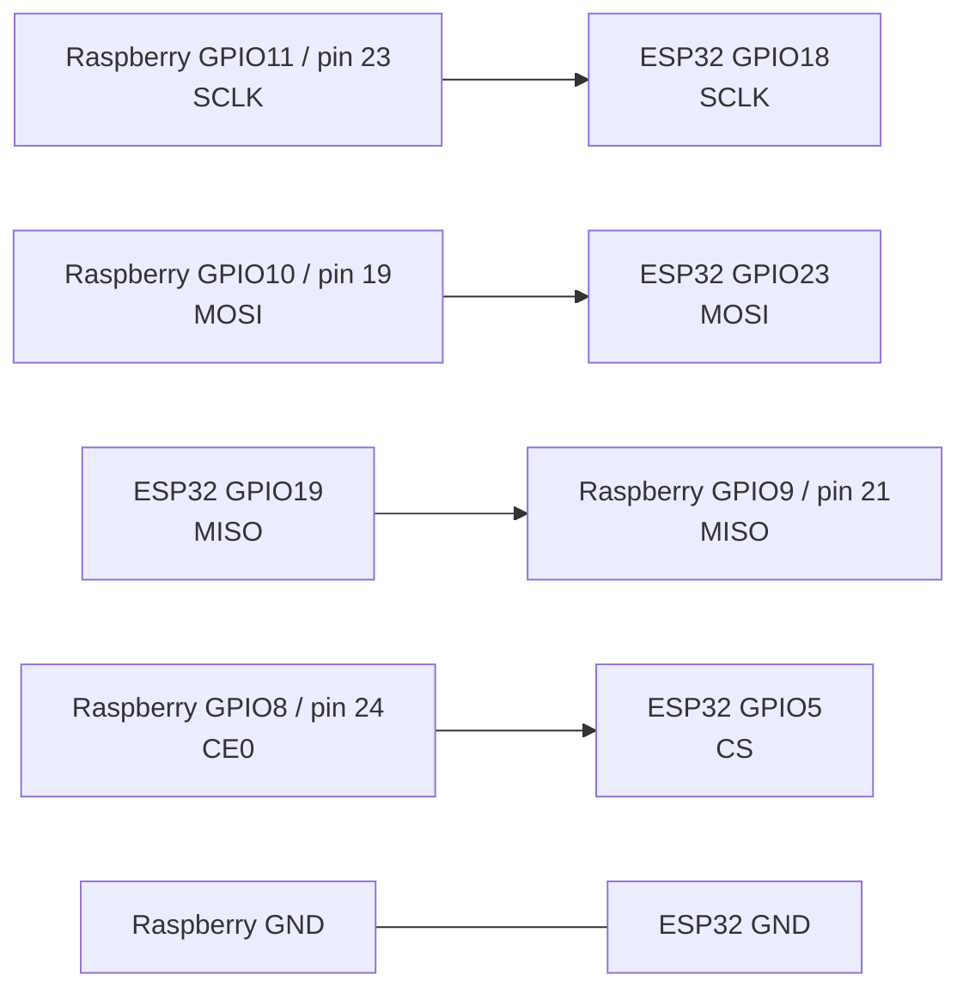
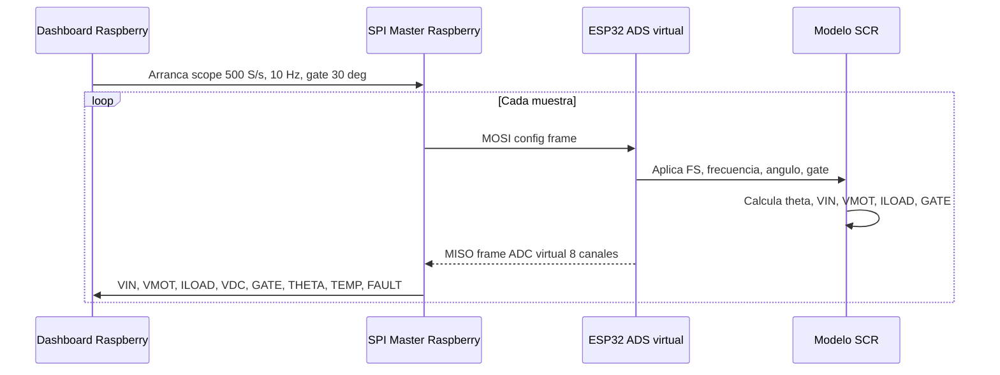

# Current Simulation Diagram

Estado del demo actual para simular el frente de medicion/control antes de tener la tarjeta Zynq fisica.

## Arquitectura



## Cableado SPI



## Flujo De Senales



## Canales Simulados

| Canal | Nombre | Significado |
| --- | --- | --- |
| CH0 | VIN | Voltaje senoidal de entrada antes del SCR |
| CH1 | VMOT | Voltaje que llega al motor/carga despues del disparo SCR |
| CH2 | ILOAD | Corriente simulada de carga |
| CH3 | VDC | Bus DC simulado |
| CH4 | GATE | Canal analogico auxiliar de gate |
| CH5 | THETA | Angulo electrico 0..360 deg |
| CH6 | TEMP | Temperatura simulada |
| CH7 | FAULT | Falla simulada |

## Comportamiento Esperado

Con la configuracion actual:

- La entrada `VIN` debe verse como una senoide de aproximadamente `+/-170 V`.
- El pulso `GATE` aparece despues del cruce por cero, en el angulo configurado.
- `VMOT` queda en cero antes del disparo y sigue la senoide despues del disparo, simulando el recorte por SCR.
- A `10 Hz` y `500 S/s`, el dashboard tiene unas 50 muestras por ciclo, suficiente para ver claramente la forma de onda sin saturar la Raspberry.
- El estado `0x0005` significa `enabled` y `gate activo` cuando coincide el pulso.

## Version Actual

El firmware Arduino correcto debe mostrar:

```cpp
// Required firmware baseline: commit 73a74ff
```

