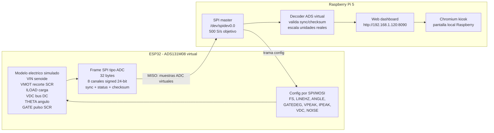
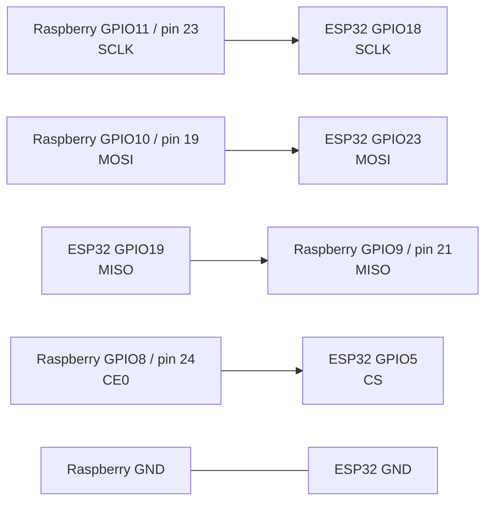
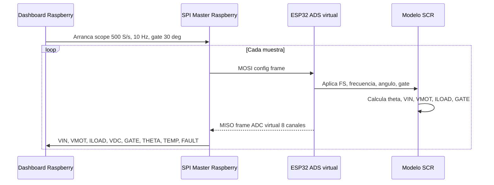
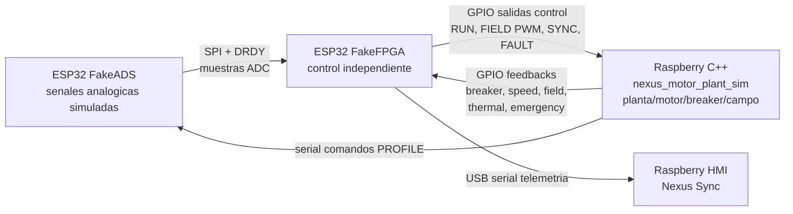

# Current Simulation Diagram

Estado del demo actual para simular el frente de medicion/control antes de tener la tarjeta Zynq fisica.

## Arquitectura



## Cableado SPI



## Flujo De Senales



## Canales Simulados

| Canal | Nombre | Significado |
| --- | --- | --- |
| CH0 | VIN | Voltaje senoidal de entrada antes del SCR |
| CH1 | VMOT | Voltaje que llega al motor/carga despues del disparo SCR |
| CH2 | ILOAD | Corriente simulada de carga |
| CH3 | VDC | Bus DC simulado |
| CH4 | GATE | Canal analogico auxiliar de gate |
| CH5 | THETA | Angulo electrico 0..360 deg |
| CH6 | TEMP | Temperatura simulada |
| CH7 | FAULT | Falla simulada |

## Comportamiento Esperado

Con la configuracion actual:

- La entrada `VIN` debe verse como una senoide de aproximadamente `+/-170 V`.
- El pulso `GATE` aparece despues del cruce por cero, en el angulo configurado.
- `VMOT` queda en cero antes del disparo y sigue la senoide despues del disparo, simulando el recorte por SCR.
- A `10 Hz` y `500 S/s`, el dashboard tiene unas 50 muestras por ciclo, suficiente para ver claramente la forma de onda sin saturar la Raspberry.
- El estado `0x0005` significa `enabled` y `gate activo` cuando coincide el pulso.

## Version Actual

El firmware Arduino correcto debe mostrar:

```cpp
// Required firmware baseline: commit 73a74ff
```

## Nexus Sync - Planta Simulada En Raspberry

Nueva arquitectura propuesta para madurar el control antes de migrarlo a PZ7020-StarLite:



### Mapa Fisico Fase 1

Lineas actuales FakeFPGA -> Raspberry:

| Senal | FakeFPGA ESP32 | Raspberry BCM | Pin fisico Pi |
| --- | ---: | ---: | ---: |
| MOTOR_RUN_CMD | GPIO25 | GPIO5 | 29 |
| FIELD_ENABLE_CMD | GPIO15 | GPIO26 | 37 |
| FIELD_PWM_CMD | GPIO27 | GPIO6 | 31 |
| SYNC_PULSE | GPIO26 | GPIO13 | 33 |
| FAULT_OUT | GPIO33 | GPIO19 | 35 |

Feedbacks Raspberry -> FakeFPGA reservados:

| Senal | Raspberry BCM | Pin fisico Pi | FakeFPGA ESP32 |
| --- | ---: | ---: | ---: |
| BREAKER_CLOSED_FB | GPIO17 | 11 | GPIO13 |
| SPEED_OK_FB | GPIO22 | 15 | GPIO14 |
| FIELD_CURRENT_FB | GPIO23 | 16 | GPIO16 |
| DISCHARGE_CURRENT_FB | GPIO24 | 18 | GPIO17 |
| THERMAL_OK_FB | GPIO25 | 22 | GPIO21 |
| EXCITER_READY_FB | GPIO12 | 32 | GPIO22 |
| LOAD_READY_FB | GPIO16 | 36 | GPIO32 |
| EMERGENCY_OK_FB | GPIO20 | 38 | GPIO34 |
| PLANT_FAULT_FB | GPIO21 | 40 | GPIO35 |

Notas:

- Todos los GPIO son 3.3 V.
- Usar GND comun.
- No reutilizar GPIO4, GPIO5, GPIO18, GPIO19, GPIO23 del FakeFPGA porque pertenecen a SPI/DRDY del FakeADS.
- `FIELD_ENABLE_CMD` es permiso/contactor digital de campo; `FIELD_PWM_CMD` queda como referencia PWM.
- Los feedbacks quedan listos para la siguiente fase, cuando FakeFPGA deje de depender de `processSim` interno.

### Plan Siguiente

1. Compilar y probar `raspi_motor_plant_sim` en Raspberry en modo `--dry-run`.
2. Probar lectura/escritura GPIO sin conectar aun al ESP32.
3. Actualizar FakeFPGA para leer feedbacks fisicos.
4. Reemplazar gradualmente variables internas de `processSim` por feedbacks de planta.
